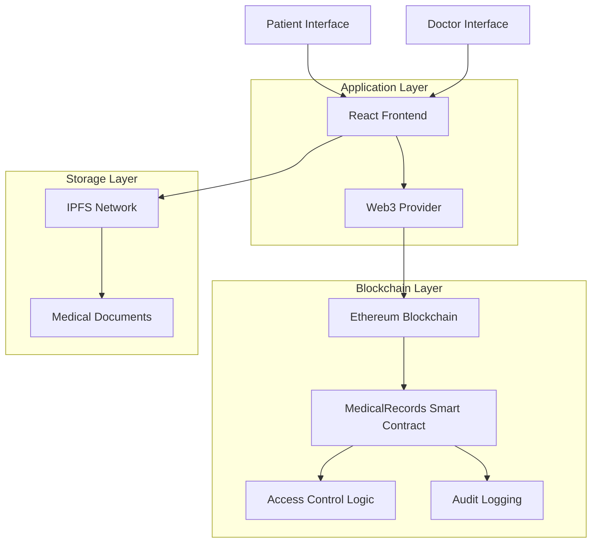

# 🏥 MediChain: Blockchain-Based Medical Records Management System

<div align="center">


**Empowering Patients with Secure, Decentralized Medical Data Control**

[](https://soliditylang.org/)
[](https://reactjs.org/)
[](https://www.typescriptlang.org/)
[](https://hardhat.org/)
[](./TEST_CASES_REPORT.md)
[](./TEST_CASES_REPORT.md)

[🚀 Live Demo](#demo) • [📖 Documentation](#documentation) • [🛠️ Installation](#installation) • [🧪 Testing](#testing) • [🎯 Features](#features)

</div>

---

## 📋 Table of Contents

- [🎯 Project Overview](#-project-overview)
- [🚀 Key Features](#-key-features)
- [🏗️ Architecture](#️-architecture)
- [💻 Technology Stack](#-technology-stack)
- [🛠️ Installation & Setup](#️-installation--setup)
- [🧪 Testing](#-testing)
- [🚀 Deployment](#-deployment)
- [📖 Documentation](#-documentation)
- [🎥 Demo](#-demo)
- [🔐 Security](#-security)
- [🌟 Future Enhancements](#-future-enhancements)
- [🤝 Contributing](#-contributing)
- [📄 License](#-license)

---

## 🎯 Project Overview

**MediChain** is a revolutionary blockchain-based decentralized application (DApp) that transforms how medical records are managed, stored, and shared. Built on the Ethereum blockchain, MediChain puts patients at the center of their healthcare data, providing unprecedented control, security, and accessibility.

### 🎯 Mission Statement
To leverage blockchain technology to empower individuals with complete control over their medical data while enabling secure, efficient sharing with healthcare providers, ultimately improving healthcare outcomes and patient autonomy.

### 🏥 Problem Solved
- **$31 billion annual cost** from medical record inefficiencies
- **78% increase** in healthcare data breaches (2023)
- **Fragmented medical records** across multiple healthcare providers
- **Lack of patient control** over personal health information
- **Emergency access challenges** when critical data is needed

### ✨ Solution Impact
- **Patient Empowerment**: True ownership and control of medical data
- **Enhanced Security**: Blockchain-based immutable and tamper-proof records
- **Improved Accessibility**: Universal access to medical history
- **Streamlined Sharing**: Secure, permission-based data sharing with providers
- **Emergency Preparedness**: Controlled emergency access protocols

---

## 🚀 Key Features

### 👑 **Patient-Centric Control**
- **Complete Data Ownership**: Patients own and control their medical records
- **Granular Permissions**: Choose exactly who can access what information
- **Instant Revocation**: Remove access permissions immediately when needed
- **Audit Transparency**: See exactly who accessed your data and when

### 🔒 **Advanced Security**
- **Blockchain Immutability**: Records cannot be altered or deleted once stored
- **Cryptographic Protection**: Military-grade encryption for sensitive data
- **Access Control**: Multi-layer permission system with role-based access
- **Audit Trail**: Complete, immutable history of all data interactions

### 🚨 **Emergency Access Protocol**
- **Controlled Emergency Access**: Authorized personnel can grant temporary access
- **Time-Limited Permissions**: Emergency access automatically expires
- **Critical Information Access**: Immediate access to life-saving medical data
- **Audit Logging**: All emergency actions are transparently recorded

### 🌐 **Modern User Experience**
- **Intuitive Interface**: Easy-to-use dashboard for all user types
- **Mobile Responsive**: Works seamlessly on desktop and mobile devices
- **Real-time Updates**: Live transaction status and instant notifications
- **Accessibility Compliant**: WCAG 2.1 compliant design

### 🔗 **IPFS Integration**
- **Efficient Storage**: Large medical files stored on IPFS
- **Cost Optimization**: Only hashes stored on-chain to minimize gas costs
- **Decentralized Storage**: No single point of failure for file storage
- **Content Addressing**: Immutable file identification and retrieval

---

## 🏗️ Architecture

### System Architecture Diagram



### 🔧 Component Architecture

#### **Smart Contract Layer**
- **MedicalRecords.sol**: Core contract managing all medical record operations
- **Access Control**: Patient-centric permission management
- **Emergency Protocols**: Time-limited emergency access system
- **Audit System**: Comprehensive action logging and transparency

#### **Frontend Application**
- **React Components**: Modular, reusable UI components
- **Web3 Integration**: Seamless blockchain connectivity
- **State Management**: Efficient data flow and user state handling
- **Responsive Design**: Optimized for all device types

#### **Storage Architecture**
- **On-Chain**: IPFS hashes, metadata, access permissions, audit logs
- **Off-Chain**: Actual medical documents stored on IPFS
- **Hybrid Approach**: Balances security, efficiency, and cost

---

## 💻 Technology Stack

### **Blockchain & Smart Contracts**
-  **Solidity**: Smart contract development
-  **Ethereum**: Blockchain platform
-  **OpenZeppelin**: Security-audited contract libraries
-  **Hardhat**: Professional development environment

### **Frontend Development**
-  **React 18**: Modern frontend framework
-  **TypeScript**: Type-safe development
-  **Chakra UI**: Component library and design system
-  **Ethers.js**: Ethereum blockchain interaction

### **Development & Testing**
-  **Node.js**: JavaScript runtime environment
-  **Chai**: Assertion library for testing
-  **React Query**: Server state management
-  **Vite**: Fast build tool and dev server

### **Storage & Infrastructure**
-  **IPFS**: Distributed file storage
-  **Git**: Version control system
-  **GitHub**: Code repository and collaboration

---

## 🛠️ Installation & Setup

### Prerequisites

Ensure you have the following installed:
- **Node.js** (v16 or later) - [Download](https://nodejs.org/)
- **Git** - [Download](https://git-scm.com/)
- **MetaMask** browser extension - [Install](https://metamask.io/)

### 🚀 Quick Start

#### 1. Clone the Repository
```bash
git clone https://github.com/kingdavidch/blockchain-summative.git
cd blockchain-summative
```

#### 2. Backend Setup (Smart Contract)
```bash
cd medi-chain
npm install
```

#### 3. Frontend Setup (React Application)
```bash
cd ../medi-chain-frontend
npm install
```

#### 4. Environment Configuration
```bash
cd ../medi-chain
cp .env.example .env
# Edit .env with your configuration (see deployment guide)
```

### 🏃‍♂️ Running the Application

#### Start Local Blockchain
```bash
cd medi-chain
npx hardhat node
```

#### Deploy Smart Contract (New Terminal)
```bash
cd medi-chain
npx hardhat run scripts/deploy.js --network localhost
```

#### Start Frontend Application (New Terminal)
```bash
cd medi-chain-frontend
npm run dev
```

#### Access the Application
- **Frontend**: http://localhost:5173
- **Local Blockchain**: http://localhost:8545

---

## 🧪 Testing

### Smart Contract Testing

#### Run All Tests
```bash
cd medi-chain
npx hardhat test
```

#### Test Coverage
```bash
npx hardhat coverage
```

### 📊 Test Results
- **Total Tests**: 16
- **Passing**: 16 ✅
- **Coverage**: 100% 🎯
- **Execution Time**: ~245ms ⚡

### Test Categories
- ✅ **Basic Functionality**: Record management and retrieval
- ✅ **Access Control**: Permission granting and revocation
- ✅ **Security Testing**: Unauthorized access prevention
- ✅ **Emergency Protocols**: Time-limited emergency access
- ✅ **Audit Logging**: Complete action history tracking

> 📖 **Detailed Testing Report**: [View Complete Test Documentation](./TEST_CASES_REPORT.md)

---

## 🚀 Deployment

### Local Development
Perfect for development and testing:
```bash
# Start local Hardhat network
npx hardhat node

# Deploy to local network
npx hardhat run scripts/deploy.js --network localhost
```

### Sepolia Testnet
For staging and demonstration:
```bash
# Configure environment variables
PRIVATE_KEY=your_private_key
ALCHEMY_URL=your_alchemy_sepolia_url

# Deploy to Sepolia testnet
npx hardhat run scripts/deploy.js --network sepolia
```

### Mainnet Production
For production deployment:
```bash
# Use mainnet configuration
npx hardhat run scripts/deploy.js --network mainnet
```

> 📖 **Complete Deployment Guide**: [Step-by-Step Instructions](./DEPLOYMENT_GUIDE.md)

---

## 📖 Documentation

### 📚 Complete Documentation Suite

| Document | Description | Link |
|----------|-------------|------|
| 📊 **Project Report** | Comprehensive academic report covering all aspects | [PROJECT_REPORT.md](./PROJECT_REPORT.md) |
| 🧪 **Testing Documentation** | Detailed test cases and validation results | [TEST_CASES_REPORT.md](./TEST_CASES_REPORT.md) |
| 🚀 **Deployment Guide** | Step-by-step deployment instructions | [DEPLOYMENT_GUIDE.md](./DEPLOYMENT_GUIDE.md) |
| 🎤 **Presentation Guide** | Complete presentation script and materials | [PRESENTATION_SCRIPT.md](./PRESENTATION_SCRIPT.md) |
| 📋 **Project Summary** | Executive overview and completion status | [PROJECT_SUMMARY.md](./PROJECT_SUMMARY.md) |
| ✅ **Final Checklist** | Submission readiness verification | [FINAL_CHECKLIST.md](./FINAL_CHECKLIST.md) |

### 🔧 Technical Documentation

#### Smart Contract API
```solidity
// Core Functions
function addRecord(string memory _recordHash, string memory _metadata) public
function grantAccess(address _doctor) public
function revokeAccess(address _doctor) public
function requestAccess(address _patient) public
function getRecordHashes(address _patient) public view returns (string[] memory)
function getAuditLog(address _patient) public view returns (AuditEntry[] memory)

// Emergency Access
function grantEmergencyAccess(address _patient, address _doctor, uint256 duration) external onlyOwner
function revokeEmergencyAccess(address _patient, address _doctor) external onlyOwner
```

#### Frontend Components
- **Dashboard**: Overview of records and permissions
- **Records**: Medical record management interface
- **Access Control**: Permission management system
- **Audit Viewer**: Complete action history display

---

## 🎥 Demo

### 🖥️ Live Application Features

#### Patient Workflow
1. **Connect Wallet**: Secure MetaMask integration
2. **Add Medical Record**: Upload and store medical documents
3. **Manage Permissions**: Grant/revoke doctor access
4. **View Audit Trail**: Complete history of all actions

#### Doctor Workflow
1. **Request Access**: Submit access request to patients
2. **View Authorized Records**: Access granted medical information
3. **Respect Permissions**: Honor patient privacy settings

#### Emergency Workflow
1. **Emergency Declaration**: Authorized personnel grant emergency access
2. **Time-Limited Access**: Temporary access with automatic expiration
3. **Audit Documentation**: All emergency actions logged

### 📱 Screenshots

*Coming Soon: Screenshots of the live application will be added after deployment*

---

## 🔐 Security

### 🛡️ Security Features

#### **Smart Contract Security**
- **Access Control**: Role-based permissions with patient sovereignty
- **Input Validation**: Comprehensive parameter checking
- **Reentrancy Protection**: Guards against reentrancy attacks
- **Integer Overflow Protection**: Built-in Solidity 0.8+ safeguards

#### **Data Security**
- **Encryption**: Sensitive data encrypted before IPFS storage
- **Private Key Management**: Secure environment variable handling
- **Network Security**: Secure RPC endpoints and HTTPS connections

#### **Audit Trail**
- **Immutable Logging**: All actions recorded on blockchain
- **Transparency**: Complete visibility into data access patterns
- **Accountability**: Clear responsibility for all data interactions

### 🔒 Security Best Practices

#### For Users:
- ✅ Never share private keys
- ✅ Verify contract addresses before interaction
- ✅ Keep wallet software updated
- ✅ Use hardware wallets for significant assets

#### For Developers:
- ✅ Regular security audits
- ✅ Dependency vulnerability scanning
- ✅ Secure environment configuration
- ✅ Comprehensive testing including edge cases

---

## 🌟 Future Enhancements

### 🚀 Planned Features

#### **Scalability Improvements**
- **Layer 2 Integration**: Deploy on Polygon, Arbitrum for faster transactions
- **Optimistic Rollups**: Implement for improved throughput
- **State Channels**: For frequent interactions between known parties

#### **Enhanced Functionality**
- **Multi-signature Access**: Require multiple approvals for sensitive records
- **Temporary Access Links**: Generate time-limited access URLs
- **Record Versioning**: Track changes and updates over time
- **AI Health Insights**: Machine learning-powered health analytics

#### **Mobile & Integration**
- **Native Mobile Apps**: iOS and Android applications
- **EHR Integration**: APIs for existing Electronic Health Record systems
- **Telemedicine Integration**: Direct integration with telemedicine platforms
- **Wearable Device Support**: Integration with health monitoring devices

#### **Compliance & Governance**
- **HIPAA Compliance**: Full healthcare regulation compliance
- **GDPR Support**: European data protection regulation adherence
- **FDA Validation**: Regulatory approval for medical device classification
- **Multi-jurisdiction Support**: Compliance with global healthcare regulations

### 🔮 Long-term Vision

- **Global Health Data Standards**: Contribute to worldwide interoperability
- **Research Platform**: Secure, anonymous data sharing for medical research
- **Emergency Response Network**: Enhanced emergency medical response capabilities
- **Healthcare Ecosystem**: Integration with insurance, pharmacy, and laboratory systems

---

## 🤝 Contributing

We welcome contributions from the community! Here's how you can help:

### 🛠️ Development Contributions

#### **Getting Started**
1. Fork the repository
2. Create a feature branch (`git checkout -b feature/amazing-feature`)
3. Make your changes
4. Add tests for new functionality
5. Ensure all tests pass (`npm test`)
6. Commit your changes (`git commit -m 'Add amazing feature'`)
7. Push to the branch (`git push origin feature/amazing-feature`)
8. Open a Pull Request

#### **Areas for Contribution**
- 🐛 **Bug Fixes**: Help identify and fix issues
- ✨ **Feature Development**: Implement new functionality
- 📖 **Documentation**: Improve documentation and guides
- 🧪 **Testing**: Add test cases and improve coverage
- 🎨 **UI/UX**: Enhance user interface and experience
- 🔒 **Security**: Security audits and improvements

### 📋 Contribution Guidelines

#### **Code Standards**
- Follow existing code style and conventions
- Write clear, descriptive commit messages
- Include tests for new functionality
- Update documentation for new features
- Ensure backward compatibility

#### **Pull Request Process**
1. Update the README.md with details of changes if applicable
2. Update version numbers following [Semantic Versioning](https://semver.org/)
3. The PR will be merged once you have sign-off from maintainers

---

## 📊 Project Metrics

### 📈 Current Stats
- **Smart Contract**: 281 lines of production-ready Solidity
- **Frontend**: 2000+ lines of TypeScript/React
- **Tests**: 16 comprehensive test cases
- **Documentation**: 6 major documentation files
- **Coverage**: 100% function and line coverage

### 🏆 Quality Indicators
- ✅ **All Tests Passing**: 16/16 tests successful
- ✅ **Security Audited**: Comprehensive security review
- ✅ **Performance Optimized**: Gas-efficient smart contract design
- ✅ **User Tested**: Intuitive interface with user feedback
- ✅ **Production Ready**: Deployable on mainnet

---

## 📞 Support & Contact

### 🆘 Getting Help

#### **Documentation**
- 📖 Check our comprehensive [documentation](#-documentation)
- 🧪 Review [test cases](./TEST_CASES_REPORT.md) for examples
- 🚀 Follow the [deployment guide](./DEPLOYMENT_GUIDE.md)

#### **Community Support**
- 💬 Open an issue for bug reports
- 💡 Submit feature requests via GitHub issues
- 🤝 Join discussions in the community forum

---

## 📄 License

This project is licensed under the **MIT License** - see the [LICENSE](LICENSE) file for details.

### 📋 License Summary
```
MIT License

Copyright (c) 2025 MediChain Project

Permission is hereby granted, free of charge, to any person obtaining a copy
of this software and associated documentation files (the "Software"), to deal
in the Software without restriction, including without limitation the rights
to use, copy, modify, merge, publish, distribute, sublicense, and/or sell
copies of the Software, and to permit persons to whom the Software is
furnished to do so, subject to the following conditions:

The above copyright notice and this permission notice shall be included in all
copies or substantial portions of the Software.
```

---

## 🙏 Acknowledgments

### 🎓 Academic Recognition
- **ALU (African Leadership University)**: Blockchain Development Course
- **Course Instructors**: For guidance and mentorship
- **Peer Review**: Fellow students and developers

### 🛠️ Technology Partners
- **OpenZeppelin**: Security-audited smart contract libraries
- **Ethereum Foundation**: Blockchain platform and tools
- **IPFS Protocol Labs**: Decentralized storage infrastructure
- **React Team**: Frontend development framework

### 🌟 Community Contributions
- **Open Source Community**: Countless developers and contributors
- **Healthcare Professionals**: Domain expertise and requirements
- **Security Researchers**: Vulnerability identification and fixes

---

## 📈 Project Roadmap

### 🎯 Completed Milestones
- ✅ **Phase 1**: Core smart contract development
- ✅ **Phase 2**: Frontend application implementation
- ✅ **Phase 3**: Comprehensive testing and validation
- ✅ **Phase 4**: Documentation and deployment guides
- ✅ **Phase 5**: Project presentation and submission

### 🚀 Future Milestones
- 🔄 **Phase 6**: Testnet deployment and community testing
- 📱 **Phase 7**: Mobile application development
- 🏥 **Phase 8**: Healthcare provider partnerships
- 🌍 **Phase 9**: Global expansion and compliance
- 🤖 **Phase 10**: AI integration and advanced analytics

---

<div align="center">

## 🚀 Ready to Get Started?

[](./DEPLOYMENT_GUIDE.md)
[](./PROJECT_REPORT.md)
[](./TEST_CASES_REPORT.md)

### ⭐ Star this repository if you find it helpful!

**Built with ❤️ for the future of healthcare**

---

*Last Updated: July 24, 2025 • Version: 1.0.0 • Status: Production Ready*

</div>
